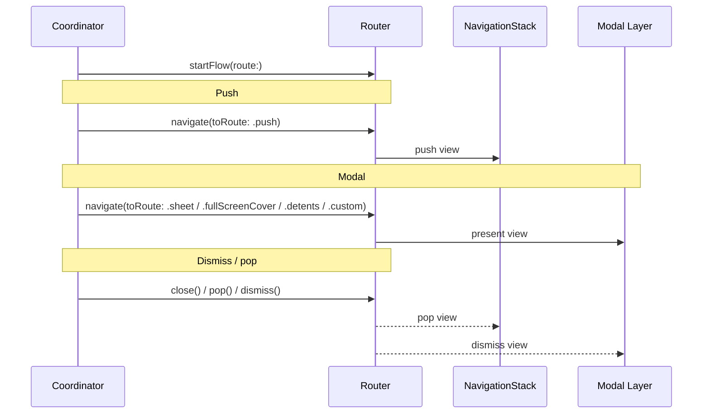

# SUICoordinator

A SwiftUI coordinator pattern library that provides clean navigation management and tab-based coordination for iOS applications. SUICoordinator separates navigation logic from view presentation, making your SwiftUI apps more maintainable and scalable.

[](https://swift.org)
[](https://developer.apple.com/ios/)
[](https://developer.apple.com/xcode/swiftui/)
[](https://opensource.org/licenses/MIT)

_____

## Key Features

- **Pure SwiftUI**: No UIKit dependencies — built entirely with SwiftUI
- **Coordinator Pattern**: Clean separation of navigation logic from views
- **Dual iOS Support**: `SUICoordinator` (iOS 17+, `@Observable`) and `SUICoordinator16` (iOS 16+, `ObservableObject`) — same API, pick the right target for your deployment
- **`@Coordinator` Macro**: Optional Swift macro for a lighter, composition-based coordinator syntax (iOS 17+)
- **Flexible Presentations**: Push, sheet, fullscreen, detents, and custom transitions
- **Tab Coordination**: Advanced tab-based navigation with `TabCoordinator`, custom views, and badges
- **Deep Linking**: Force presentation capabilities for push notifications and external triggers
- **Async Navigation**: Full async/await support for smooth navigation flows

_____

## Targets

SUICoordinator ships two importable products that expose the same public API:

- **`SUICoordinator`** (iOS 17+) — uses `@Observable`. Recommended for new projects.
- **`SUICoordinator16`** (iOS 16+) — uses `ObservableObject` + Combine. See [SUICoordinator16.md](SUICoordinator16.md) for the full guide.

_____

## Installation

### Swift Package Manager

1. Open Xcode and your project
2. Go to `File` → `Add Package Dependencies...`
3. Enter the repository URL: `https://github.com/felilo/SUICoordinator`
4. Select the package product that matches your deployment target (see [Targets](#targets) above)

> A single `import SUICoordinator` (or `import SUICoordinator16`) is all you need — all public types are available immediately.

_____

## Basic Usage

### 1. Define Your Routes

Create an enum that conforms to `RouteType`. Each case maps to a SwiftUI view and declares how it should be presented.

```swift
import SwiftUI
import SUICoordinator

enum HomeRoute: RouteType {
    case homeView(dependencies: DependenciesHomeView)
    case pushView(dependencies: DependenciesPushView)
    case sheetView(coordinator: HomeCoordinator)

    var presentationStyle: TransitionPresentationStyle {
        switch self {
            case .sheetView: .sheet
            default: .push
        }
    }

    @ViewBuilder
    var body: some View {
        switch self {
            case .homeView(let dependencies): HomeView(dependencies: .init(dependencies))
            case .pushView(let dependencies): PushView(dependencies: .init(dependencies))
            case .sheetView(let coordinator): SheetView(coordinator: coordinator)
        }
    }
}
```

### 2. Create Your Coordinator

```swift
import SUICoordinator

@Coordinator(HomeRoute.self)
class HomeCoordinator {

    func start() async {
        let dependencies = HomeViewDependencies()
        await startFlow(route: .homeView(dependencies: dependencies))
    }

    func navigateToPushView() async {
        let dependencies = PushViewDependencies()
        await navigate(toRoute: .pushView(dependencies: dependencies))
    }

    func presentSheet() async {
        await navigate(toRoute: .sheetView(coordinator: self))
    }

    func endThisCoordinator() async {
        await finishFlow()
    }
}
```

> **iOS 16 support**: If your deployment target is iOS 16, use `SUICoordinator16` instead. See [SUICoordinator16.md](SUICoordinator16.md) for the complete guide.

### 3. Define Views

Use `@Environment` to access the coordinator from your views:

```swift
import SwiftUI
import SUICoordinator

struct HomeView: View {
    @Environment(HomeCoordinator.self) var coordinator

    var body: some View {
        List {
            Button("Push Example View") { Task { await coordinator.navigateToPushView() } }
            Button("Present Sheet Example") { Task { await coordinator.presentSheet() } }
            Button("Present Tab Coordinator") { Task { await coordinator.presentDefaultTabs() } }
        }
        .navigationTitle("Coordinator Actions")
    }
}
```

### 4. Setup in Your App

Instantiate your root coordinator and use its `getView()` method.

```swift
import SwiftUI
import SUICoordinator

@main
struct MyExampleApp: App {

    var rootCoordinator = HomeCoordinator()

    var body: some Scene {
        WindowGroup { rootCoordinator.getView() }
    }
}
```

_____

## Example Project

Explore working implementations of all features — push, sheet, fullscreen, detents, custom transitions, tab coordinators (default and custom), and deep linking.


[Examples folder →](https://github.com/felilo/SUICoordinator/tree/main/Examples/SUICoordinatorExample)

_____

## Tab Navigation

`TabCoordinator<Page: TabPage>` manages a collection of child coordinators, one per tab.

### 1. Define Your Tab Pages

Create an enum conforming to `TabPage` with three requirements:
- `position: Int` — display order of the tab (0-indexed)
- `dataSource` — a value providing the tab's visual elements (icon, title, etc.)
- `coordinator() -> any CoordinatorType` — the coordinator that manages this tab's flow

```swift
import SwiftUI
import SUICoordinator

struct AppTabPageDataSource {
    let page: AppTabPage

    @ViewBuilder var icon: some View {
        switch page {
            case .home: Image(systemName: "house.fill")
            case .settings: Image(systemName: "gearshape.fill")
        }
    }

    @ViewBuilder var title: some View {
        switch page {
            case .home: Text("Home")
            case .settings: Text("Settings")
        }
    }
}

enum AppTabPage: TabPage, CaseIterable {
    case home
    case settings

    var position: Int {
        switch self {
            case .home: return 0
            case .settings: return 1
        }
    }

    var dataSource: AppTabPageDataSource {
        AppTabPageDataSource(page: self)
    }

    func coordinator() -> any CoordinatorType {
        switch self {
            case .home: return HomeCoordinator()
            case .settings: return SettingsCoordinator()
        }
    }
}
```

### 2. Create Your TabCoordinator

```swift
import SUICoordinator

class DefaultTabCoordinator: TabCoordinator<AppTabPage> {
    init(initialPage: AppTabPage = .home) {
        super.init(
            pages: AppTabPage.allCases,
            currentPage: initialPage,
            viewContainer: { dataSource in
                DefaultTabView(dataSource: dataSource)
            }
        )
    }
}
```

For a detailed example, see [DefaultTabView.swift](https://github.com/felilo/SUICoordinator/blob/main/Examples/SUICoordinatorExample/SUICoordinatorExample/Coordinators/TabCooridnators/DefaultTabCoordinator/DefaultTabView.swift).

### 3. Present the TabCoordinator

```swift
func presentDefaultTabs() async {
    let tabCoordinator = DefaultTabCoordinator()
    await navigate(to: tabCoordinator, presentationStyle: .sheet)
}
```

_____

## Deep Linking

Navigate to a specific part of the app from a push notification or a universal link using `forcePresentation(rootCoordinator:)`.

**General strategy:**
1. Identify the destination coordinator
2. Call `forcePresentation(presentationStyle:rootCoordinator:)` on it
3. For tab-based apps, set `currentPage` to the target tab, then navigate within the selected child coordinator

```swift
@main
struct MyExampleApp: App {

    var rootCoordinator = DefaultTabCoordinator()

    var body: some Scene {
        WindowGroup {
            rootCoordinator.getView()
                .onReceive(NotificationCenter.default.publisher(for: Notification.Name.PushNotification)) { object in
                    guard let urlString = object.object as? String,
                          let path = DeepLinkPath(rawValue: urlString) else { return }
                    Task { try? await handleDeepLink(path: path) }
                }
                .onOpenURL { incomingURL in
                    guard let host = URLComponents(url: incomingURL, resolvingAgainstBaseURL: true)?.host,
                          let path = DeepLinkPath(rawValue: host) else { return }
                    Task { @MainActor in try? await handleDeepLink(path: path) }
                }
        }
    }

    enum DeepLinkPath: String {
        case home = "home"
        case tabCoordinator = "tabs-coordinator"
    }

    @MainActor func handleDeepLink(path: DeepLinkPath) async throws {
        switch path {
        case .tabCoordinator:
            if let coordinator = try rootCoordinator.getCoordinatorPresented() as? HomeCoordinator {
                await coordinator.presentSheet()
            } else {
                let homeCoordinator = HomeCoordinator()
                try await homeCoordinator.forcePresentation(rootCoordinator: rootCoordinator)
                await homeCoordinator.presentSheet()
            }
        case .home:
            let coordinator = HomeCoordinator()
            try await coordinator.forcePresentation(
                presentationStyle: .sheet,
                rootCoordinator: rootCoordinator
            )
        }
    }
}
```

_____

## API Reference

A `Coordinator` owns a `Router`, which drives both the navigation stack and modal presentations. Routes (`RouteType`) are the unit of navigation — each one declares how it should be presented (`presentationStyle`) and what it renders (`body`). You never interact with the `Router` directly in most cases; the `Coordinator` exposes convenience methods that delegate to it.



_____

### RouteType

Every route enum must conform to `RouteType`. Two requirements:

- **`var presentationStyle: TransitionPresentationStyle`** — how the view is presented:

| Style | Description |
|-------|-------------|
| `.push` | Pushes onto the navigation stack |
| `.sheet` | Standard modal sheet |
| `.fullScreenCover` | Modal covering the entire screen |
| `.detents([...])` | Sheet that rests at specific heights (e.g., `.detents([.medium, .large])`) |
| `.custom(transition:animation:fullScreen:)` | Custom SwiftUI transition |

- **`var body: some View`** — the SwiftUI view rendered for that route case

```swift
import SwiftUI
import SUICoordinator

enum AppRoute: RouteType {
    case login
    case dashboard(userId: String)
    case helpSheet
    case customTransitionView

    var presentationStyle: TransitionPresentationStyle {
        switch self {
            case .login: return .fullScreenCover
            case .dashboard: return .push
            case .helpSheet: return .detents([.medium, .large])
            case .customTransitionView:
                return .custom(
                    transition: .asymmetric(insertion: .move(edge: .trailing), removal: .move(edge: .leading)),
                    animation: .easeInOut(duration: 0.5),
                    fullScreen: true
                )
        }
    }

    @ViewBuilder
    var body: some View {
        switch self {
            case .login: LoginView()
            case .dashboard(let userId): DashboardView(userId: userId)
            case .helpSheet: HelpView()
            case .customTransitionView: MyCustomAnimatedView()
        }
    }
}
```

> You can also use `DefaultRoute` for generic views when you don't need a typed route enum — as demonstrated in the [NavigationHubCoordinator example](https://github.com/felilo/SUICoordinator/blob/main/Examples/SUICoordinatorExample/SUICoordinatorExample/Coordinators/NavigationHubCoordinator/NavigationHubCoordinator.swift).

_____

### Coordinator

| Method | Description |
|--------|-------------|
| `start()` | Override to define the initial view or flow, typically via `await startFlow(route:)`. |
| `startFlow(route:)` | Clears the current stack and starts a new flow with the given route. |
| `finishFlow(animated:)` | Dismisses all views of this coordinator and removes it from its parent. |
| `navigate(toRoute:presentationStyle:animated:)` | Navigates to a route within this coordinator's flow. |
| `navigate(to:presentationStyle:animated:)` | Presents another coordinator, adds it as a child, and calls its `start()`. |
| `forcePresentation(presentationStyle:animated:rootCoordinator:)` | Presents this coordinator from the top of the hierarchy. Used for deep links. |
| `restart(animated:)` | Resets the coordinator's navigation state to its initial route. |
| `close(animated:)` | Dismisses if presented modally; pops if pushed. |
| `getView()` | Returns the SwiftUI view for this coordinator. Use this to embed it in your app or another view. |
| `getCoordinatorPresented(customRootCoordinator:)` | Returns the coordinator currently visible to the user, walking the full hierarchy. |

_____

### Router

The `Router` is available as `coordinator.router` and manages the navigation stack and modal presentations for a single coordinator's flow. Most navigation is done through the `Coordinator` methods above, but the `Router` is useful when you need lower-level control.

| Method / Property | Description |
|-------------------|-------------|
| `mainView: Route?` | The root view of the coordinator's flow. |
| `items: [Route]` | The current navigation stack (push items). |
| `navigate(toRoute:presentationStyle:animated:)` | Navigates to the given route. `.push` appends to the stack; all other styles present modally. |
| `present(_:presentationStyle:animated:)` | Presents a view modally. Defaults to `.sheet` if no style is provided. |
| `pop(animated:)` | Pops the top view from the navigation stack. |
| `popToRoot(animated:)` | Pops all views except the root from the navigation stack. |
| `dismiss(animated:)` | Dismisses the top-most modally presented view. |
| `close(animated:)` | Dismisses if presented modally; pops if on the navigation stack. |
| `restart(animated:)` | Clears all stacks and modal presentations, returning to the initial state. |

_____

### TabCoordinator

`TabCoordinator` conforms to both `TabCoordinatorType` and `CoordinatorType`, so all methods from the [Coordinator](#coordinator) table are also available on a `TabCoordinator` instance.

The following properties and methods are specific to `TabCoordinator`:

| Method / Property | Description |
|-------------------|-------------|
| `pages: [Page]` | The array of `TabPage` cases defining the tabs. |
| `currentPage: Page` | Get or set the currently selected tab programmatically. |
| `setCurrentPage(_:)` | Switches to the given tab, validating it exists and differs from the current one. |
| `setPages(_:currentPage:)` | Dynamically updates the tab set, initializing coordinators for new pages and cleaning up removed ones. |
| `getCoordinatorSelected()` | Returns the child coordinator for the currently selected tab (throws if not found). |
| `getCoordinator(with:)` | Returns the child coordinator for a given `TabPage`, or `nil` if not found. |
| `setBadge(for:with:)` | Sets or removes a badge on a tab. Pass `nil` as the value to remove it. |
| `popToRoot()` | Pops the active tab's navigation stack to its root view. |

_____

## Contributing

Contributions are welcome! Fork the repository, make your changes in a new branch, and open a pull request for review.
